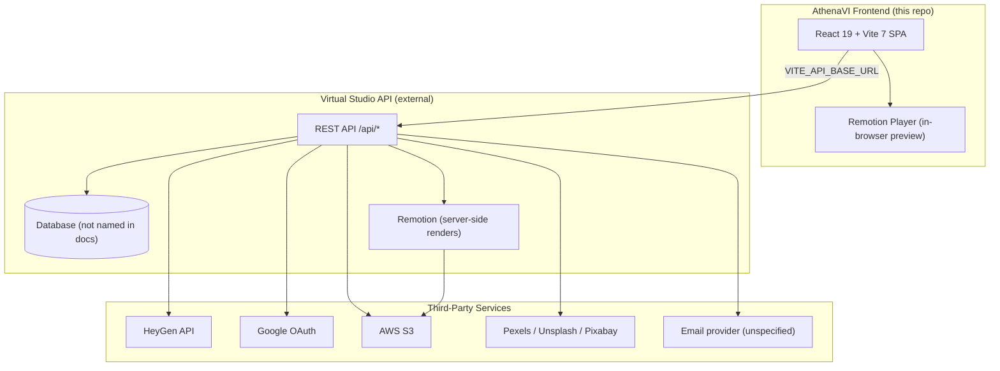

# Athena VI — Technology Stack

This document describes the frontend and backend technologies, third-party APIs, and infrastructure used in the Athena VI (Virtual Studio) platform.

**Note:** `AthenaVI` is a **frontend-only** repository. The backend (“Virtual Studio API”) is a separate service. Backend details below are inferred from API documentation in this repo (`api_doc.md`, `HEYGEN.md`, `workspace-api.md`).

---

## Architecture at a Glance



| Environment | Frontend | Backend API |
|-------------|----------|-------------|
| **Production** | AWS EKS + ECR (Jenkins) or Render static site | `https://api.vs.lmsathena.com` |
| **Local dev** | Vite dev server | `http://localhost:9000` (proxied via `/api`) |

---

## Frontend (This Repository)

### Core Stack

| Category | Technology | Version / Notes |
|----------|------------|-----------------|
| **Framework** | React | 19.2 |
| **Language** | JavaScript (JSX) | No TypeScript in `src/` |
| **Build tool** | Vite | 7.2 |
| **Module system** | ESM | `"type": "module"` |
| **Node.js** | 22.22.0 (Render) / 20 (Docker) | `.nvmrc` + `Dockerfile` |
| **Linting** | ESLint 9 (flat config) | `npm run lint` only |
| **Testing** | None configured | No Jest/Vitest/Cypress |

### UI & UX Libraries

| Library | Purpose |
|---------|---------|
| **Custom components** | Primary UI (`src/components/ui/`, `features/`, `layout/`) |
| **lucide-react** | Icons |
| **react-icons** | Icons (Md, Fa, Hi2, Fi families) |
| **framer-motion** | Page/section animations |
| **@use-gesture/react** | Touch/drag (e.g. DomeGallery) |
| **remotion** + **@remotion/player** | Video editor preview/composition |
| **jspdf** | Client-side PDF generation (digital twin scripts) |

**Not used:** MUI, Chakra, Ant Design, Radix, shadcn, Bootstrap, styled-components, Sass.

### State Management & Routing

| Approach | Details |
|----------|---------|
| **State** | React Context (`AuthContext`, `ThemeContext`, `PreviewModeContext`) + hooks |
| **Storage** | `localStorage` (`accessToken`, `user`, theme prefs) |
| **Routing** | Custom SPA routing in `App.jsx` — **no react-router** |
| **URL sync** | `history.pushState` + `popstate`; hash fallback for OAuth |
| **Data fetching** | `fetch` + custom service layer; **axios** only for auth (token refresh) |

### Styling

| Method | Details |
|--------|---------|
| **Co-located CSS** | `.css` files per component/page |
| **CSS variables** | `src/index.css` — theme tokens, `[data-theme]` / `[data-mode]` |
| **Google Fonts** | Inter, Jost, Roboto, Montserrat (via `index.html`) |
| **Tailwind CSS** | In `devDependencies` but **not actively used** in `src/` |

### API Client Layer

Central config: `src/config/api.js`

14 service modules under `src/services/`:

| Service | Domain |
|---------|--------|
| `authService` | Login, OTP, OAuth, token refresh |
| `userService` | Profile, settings, capabilities |
| `workspaceService` | Workspaces, projects, folders, renders |
| `heygenService` | Avatars, voices, video generation |
| `assetService` | File uploads per workspace |
| `stockService` | Stock media search/import |
| `creditsService` | Credit balances & history |
| `storageService` | Storage quotas |
| `videoLibraryService` | Completed renders |
| `commentService` | Project comments |
| `inboxService` | Notifications |
| `superadminService` | Platform admin |
| `earlyAccessService` | Public early-access form |
| `invitationFlowService` | Workspace invites |

**Environment variable:** `VITE_API_BASE_URL` (required at build time for production).

### Frontend Deployment

| Platform | Stack |
|----------|-------|
| **Docker** | Node 20 build → nginx:alpine serve `dist/` |
| **Jenkins CI/CD** | npm build → SonarQube → Trivy → push to **AWS ECR** → deploy to **AWS EKS** |
| **Render.com** | Static site blueprint (`render.yaml`) |
| **AWS (documented)** | S3 + CloudFront + Route 53 + ACM |

### Project Structure

```
src/
├── components/
│   ├── features/     # Domain UI (admin, auth, editor, workspace, solutions, …)
│   ├── layout/       # Navbar, Footer, sidebars, hero sections
│   └── ui/           # Reusable modals, icons, toasts, galleries
├── pages/            # Route-level screens (Dashboard, Editor, Avatars, …)
├── hooks/            # Custom hooks
├── contexts/         # React Context providers
├── services/         # API layer (14 services)
├── utils/            # Helpers (HeyGen, editor, routing, …)
├── config/           # API config
├── constants/        # Static data, template libraries
├── styles/           # Shared style helpers
└── assets/           # Images, videos
```

---

## Backend (External — Virtual Studio API)

Backend source code is **not in this repo**. Behavior is documented in `api_doc.md`, `HEYGEN.md`, and `workspace-api.md`.

### Inferred Backend Stack

| Layer | Details |
|-------|---------|
| **API style** | REST, prefix `/api` |
| **Auth** | JWT access tokens + HTTP-only `refreshToken` cookie (rotation) |
| **Framework** | Not specified (likely Node.js based on JWT/cookie patterns, multipart uploads, Remotion) |
| **Database** | Referenced but **engine not named** (tables like `heygen_avatars`, `heygen_voices`, `heygen_responses` suggest relational DB) |
| **Object storage** | **AWS S3** for assets, HeyGen uploads, scene clips, final MP4 renders |
| **Video rendering** | **Remotion** server-side for full project exports |
| **Email** | Used for OTP, password reset, workspace invites (provider **not named**) |

### Backend API Domains

| API Group | Base Path | Purpose |
|-----------|-----------|---------|
| **Auth** | `/api/auth/*` | OTP, register, login, password reset, Google OAuth, refresh/logout |
| **User** | `/api/user/*` | Profile, settings, inbox, capabilities |
| **Workspaces** | `/api/workspaces/*` | Team/private workspaces, members, invites, folders |
| **Projects** | `/api/workspaces/:id/projects/*` | Video editor JSON, scenes, comments |
| **Renders** | `.../projects/:id/renders` | Remotion full-project MP4 export |
| **Assets** | `/api/assets/*` | Workspace file uploads (S3-backed) |
| **Credits** | `/api/credits/*` | User/workspace credit system |
| **Storage** | `/api/user/storage/*` | Quota management |
| **HeyGen** | `/api/heygen/*` | Avatar/voice proxy |
| **HeyGen Videos** | `.../projects/:id/heygen/*` | Lip-sync video jobs |
| **Stock** | `/api/stock/*` | Stock media search & import |
| **Video Library** | `/api/user/videos`, `.../workspaces/:id/videos` | Completed exports |
| **Superadmin** | `/api/superadmin/*` | Platform administration |
| **Early Access** | `/api/early-access/request` | Public signup (no auth) |
| **Templates** | `/api/templates` | Project templates |

### Documented Backend Environment Variables

| Variable | Purpose |
|----------|---------|
| `HEYGEN_API_KEY` | HeyGen API authentication |
| `HEYGEN_BASE_URL` | HeyGen host (default `https://api.heygen.com`) |
| `AWS_S3_BUCKET` | Media/render storage |
| `AWS_REGION` | S3 region |
| `AWS_ACCESS_KEY_ID` / `AWS_SECRET_ACCESS_KEY` | S3 credentials |
| `FRONTEND_URL` | OAuth redirects, email links |
| `OAUTH_SUCCESS_PATH` | e.g. `/auth/google/callback` |

### Authentication Flow

| Method | Details |
|--------|---------|
| **Email + password** | Login, OTP registration |
| **OTP (email)** | `POST /api/auth/otp/generate`, `/resend` |
| **JWT access token** | `Authorization: Bearer <token>` in localStorage |
| **Refresh token** | HTTP-only cookie `refreshToken`, rotation via `POST /api/auth/refresh` |
| **Google OAuth** | `GET /api/auth/google` → callback → redirect to `{FRONTEND_URL}/auth/google/callback#access_token=...` |
| **Password reset** | Email link flow |

---

## Third-Party APIs & Services

### Fully Integrated (via Backend Proxy)

| Service | Role | How It's Used |
|---------|------|---------------|
| **[HeyGen](https://www.heygen.com/)** | AI avatars, voice clone/design, lip-sync video | Backend proxies v3 API; frontend calls `/api/heygen/*` and workspace HeyGen routes |
| **[Google OAuth](https://developers.google.com/identity)** | Social login | `GET /api/auth/google` → callback → frontend hash token |
| **[AWS S3](https://aws.amazon.com/s3/)** | File storage | Assets, avatar training uploads, HeyGen videos, Remotion renders |
| **[Pexels](https://www.pexels.com/api/)** | Stock photos/videos | `/api/stock/search` + import (`provider=pexels`) |
| **[Unsplash](https://unsplash.com/developers)** | Stock photos | Same stock API (`provider=unsplash`) |
| **[Pixabay](https://pixabay.com/api/docs/)** | Stock photos/videos | Same stock API (`provider=pixabay`) |
| **[Remotion](https://www.remotion.dev/)** | Video composition | In-browser preview (frontend) + server-side full renders (backend) |
| **Email service** | OTP, password reset, invites, inbox | Backend sends emails (provider unspecified in docs) |

### HeyGen Integration Details

| Capability | Frontend | Backend |
|------------|----------|---------|
| Avatar groups & looks | `heygenService`, `Avatars.jsx` | `/api/heygen/avatars/*` |
| Voice design & clone | `CreateVoice.jsx`, `heygenService` | `/api/heygen/voices/*` |
| Lip-sync video generation | Editor, `heygenVideo.js` | `/api/workspaces/.../heygen/videos` |
| Avatar sharing (team) | Workspace UI | `/api/workspaces/.../heygen/avatars/:id/share` |
| S3 staging for uploads | `heygenAssetUpload.js` | `/api/heygen/avatars/upload` |

### Stock Media Integration

| Endpoint | Method | Purpose |
|----------|--------|---------|
| `/api/stock/search` | GET | Search across Pexels, Unsplash, Pixabay |
| `/api/stock/workspaces/:id/import` | POST | Import stock asset into workspace |

Frontend: `src/services/stockService.js`, `StockMediaBrowser.jsx`

### CDN / Static Assets Only (No API Integration)

| Service | Usage |
|---------|-------|
| **Unsplash** | Marketing/editor placeholder images (hardcoded URLs) |
| **Pexels** | Template assets in `public/templates/` |
| **Mixkit** | Demo stock videos in editor data |
| **Pixabay CDN** | Demo videos in `domeGalleryContent.js` |
| **Google Fonts** | Typography |
| **AWS S3 (public)** | Hero preview videos (`testing-vi.s3.us-east-1.amazonaws.com`) |

### UI Placeholders Only (Not Wired to Real APIs)

| Service | Status |
|---------|--------|
| **Stripe** | Mock “Connected” in admin UI (`PlatformModule.jsx`) |
| **SendGrid** | Mock “Connected” in admin UI |
| **YouTube** | Placeholder input in `TranslateVideoModal.jsx` |
| **AI Video Assistant** | UI only — no backend calls found |

---

## Infrastructure & DevOps

| Tool / Service | Role |
|----------------|------|
| **Jenkins** | CI/CD pipeline |
| **SonarQube** | Code quality |
| **Trivy** | Container vulnerability scanning |
| **AWS ECR** | Docker image registry (`vi-athena-frontend`) |
| **AWS EKS** | Production Kubernetes deployment |
| **AWS S3 + CloudFront + Route 53 + ACM** | Static frontend hosting (documented) |
| **Render.com** | Alternative static hosting |
| **nginx** | Production static file server (Docker) |
| **Docker** | Multi-stage frontend builds |

### Frontend Environment Variables

| Variable | Scope | Description |
|----------|-------|-------------|
| `VITE_API_BASE_URL` | Build-time | Backend API base URL (no trailing slash) |
| `VITE_ENV` | Build-time | Environment label (e.g. `production`) |

In development, `vite.config.js` proxies `/api` to `VITE_API_BASE_URL` or `http://localhost:9000` when unset.

---

## Key Product Features by Tech

| Feature | Frontend Tech | Backend / Third-Party |
|---------|---------------|----------------------|
| Video editor | Remotion Player, custom canvas | Remotion server renders → S3 |
| AI avatars & voices | `heygenService`, editor UI | HeyGen API + S3 |
| Team workspaces | `workspaceService`, React Context | REST API + DB |
| Stock media browser | `stockService`, `StockMediaBrowser` | Pexels/Unsplash/Pixabay APIs |
| Auth | `authService` (axios), `AuthContext` | JWT + Google OAuth |
| Admin portal | `superadminService` | `/api/superadmin/*` |
| PDF scripts | jsPDF (client-side) | — |
| Credits & storage | `creditsService`, `storageService` | REST API + DB |

---

## Dependencies (`package.json`)

### Production Dependencies

| Package | Version | Purpose |
|---------|---------|---------|
| `react` | ^19.2.0 | UI framework |
| `react-dom` | ^19.2.0 | React DOM renderer |
| `remotion` | ^4.0.407 | Video composition |
| `@remotion/player` | ^4.0.407 | In-browser video player |
| `axios` | ^1.13.6 | HTTP client (auth) |
| `framer-motion` | ^12.35.1 | Animations |
| `@use-gesture/react` | ^10.3.1 | Touch/drag gestures |
| `jspdf` | ^4.2.1 | PDF generation |
| `lucide-react` | ^0.577.0 | Icons |
| `react-icons` | ^5.5.0 | Icons |

### Dev Dependencies

| Package | Version | Purpose |
|---------|---------|---------|
| `vite` | ^7.2.4 | Build tool |
| `@vitejs/plugin-react` | ^5.1.1 | React plugin for Vite |
| `eslint` | ^9.39.1 | Linting |
| `tailwindcss` | ^3.4.17 | Listed but unused in `src/` |
| `typescript` | ^6.0.2 | Types only (dev) |

---

## Related Documentation

| File | Description |
|------|-------------|
| `README.md` | Setup and scripts |
| `api_doc.md` | Full backend API reference |
| `HEYGEN.md` | HeyGen integration details |
| `workspace-api.md` | Workspace, projects, renders API |
| `FRONTEND_DEVOPS_AWS.md` | AWS deployment guide |
| `render.yaml` | Render.com deployment blueprint |
| `PLATFORM_FLOW_GUIDE.md` | Platform user flows |

---

## Summary

| Layer | Stack |
|-------|-------|
| **Frontend** | React 19, Vite 7, custom routing, Context + hooks, co-located CSS, Remotion, axios/fetch |
| **Backend** | Separate Virtual Studio REST API (Node.js inferred); JWT auth; S3 storage; Remotion renders |
| **Third-party (live)** | HeyGen, Google OAuth, AWS S3, Pexels, Unsplash, Pixabay, email (unspecified) |
| **Third-party (mock/CDN only)** | Stripe, SendGrid, Unsplash/Pexels/Mixkit as static URLs |

For exact backend framework, database engine, and email provider details, refer to the **Virtual Studio backend repository** — this frontend repo documents only the API contract.
